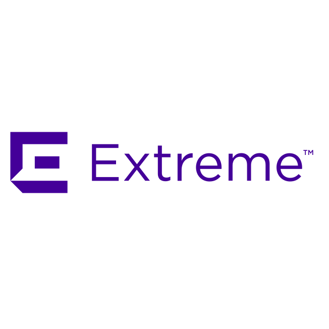
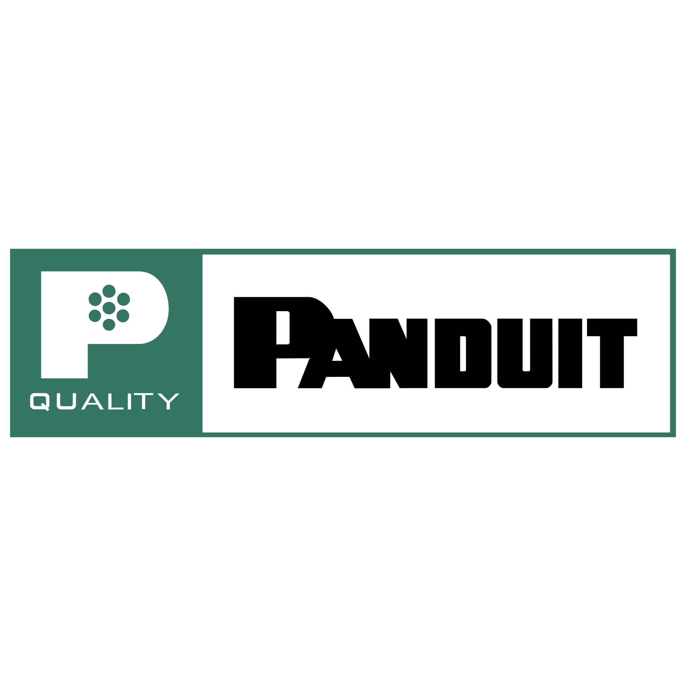

# Alcayato.com

Bienvenido a Alcayato.com, expertos en soluciones integrales para infraestructura de redes, audio profesional y seguridad contra incendios.

---

## Nuestras Marcas y Productos

### Telefire

- [Detector de Humo TFO-770A](./assets/telefire-logo.svg)  
  Detector de humo fotoeléctrico analógico direccionable, diseñado para una detección precisa y confiable de incendios. Ideal para sistemas de seguridad avanzados.

- [Detector de Calor TFH-280A](./assets/telefire-logo.svg)  
  Detector de calor analógico direccionable con tecnología avanzada, que opera en modos de temperatura fija y tasa de aumento. Compatible con paneles de control Telefire.

- [Unidad de Control GUARD-7](./assets/telefire-logo.svg)  
  Solución compacta y potente para seguridad contra incendios en sitios pequeños, con capacidad para hasta 60 dispositivos. Fácil de instalar y mantener.

- [Panel de Control ADR-7000](./assets/telefire-logo.svg)  
  Panel de control analógico direccionable de última generación, diseñado para sistemas de detección de incendios de mediana y gran escala.

---

### Bose Professional

- [Altavoz FreeSpace FS2P](./assets/bose.svg)  
  Altavoz colgante de montaje en techo con transductor de rango completo de 2.25 pulgadas, ideal para música de fondo y anuncios claros en entornos comerciales.

- [Sistema Line Array Portátil L1 Pro8](./assets/bose.svg)  
  El sistema L1 Pro más portátil, con un mezclador integrado y cobertura de sonido de 180 grados, ideal para eventos pequeños y medianos.

- [Amplificador PowerShare PS604D](./assets/bose.svg)  
  Amplificador de potencia adaptable con tecnología PowerShare que distribuye 600 watts de forma asimétrica entre todas las salidas según las necesidades.

- [Altavoz de Techo EdgeMax EM180](./assets/bose.svg)  
  Altavoz premium de montaje en techo con tecnología PhaseGuide que proporciona cobertura de 180° desde el borde de la habitación.

---

### Extreme Networks

- [Switch ExtremeSwitching X465](./assets/extreme-networks-vector-logo.svg)  
  Familia de switches apilables de alto rendimiento, listos para convergencia, resilientes y seguros, con puertos Gigabit y multi-Gigabit Ethernet.

- [Access Point AP505i](./assets/extreme-networks-vector-logo.svg)  
  Access point Wi-Fi 6 (802.11ax) de alto rendimiento para entornos empresariales, con radios duales y tecnología de antena inteligente.

- [Switch ExtremeSwitching X440-G2](./assets/extreme-networks-vector-logo.svg)  
  Switch de acceso Gigabit Ethernet de nivel empresarial, ideal para despliegues de campus y sucursales.

---

### Panduit

- [Infraestructura de Cableado Estructurado Panduit](./assets/panduit.svg)  
  Soluciones completas de cableado estructurado, incluyendo paneles de parcheo, cables y conectores, diseñadas para redes de alto rendimiento y fácil instalación.

- [Cable TX6A-SD Cat6A UTP](./assets/panduit.svg)  
  Cable de par trenzado no blindado Categoría 6A con tecnología MaTriX para reducción de alien crosstalk, ideal para aplicaciones de 10 Gigabit Ethernet.

- [Sistema de Fibra Óptica OptiCom](./assets/panduit.svg)  
  Solución completa de fibra óptica que incluye bandejas, adaptadores y accesorios para una gestión eficiente de conexiones de fibra.

---

### Inncom

- [Sistema de Domótica INNCOM Honeywell II](./assets/Logo_INNCOM.svg)  
  Soluciones avanzadas de automatización de habitaciones para hoteles, que mejoran la eficiencia energética y la experiencia del huésped.

- [Termostato Digital E7](./assets/Logo_INNCOM.svg)  
  Termostato inteligente con pantalla táctil que proporciona control preciso de temperatura y humedad, con capacidades de ahorro energético.

- [Interruptores Inteligentes Evora](./assets/Logo_INNCOM.svg)  
  Sistema de interruptores inteligentes para control de iluminación y otros dispositivos en habitaciones de hotel.

---

## Contacto

Para más información o solicitar una cotización, visita nuestra página de contacto o contáctanos directamente.
